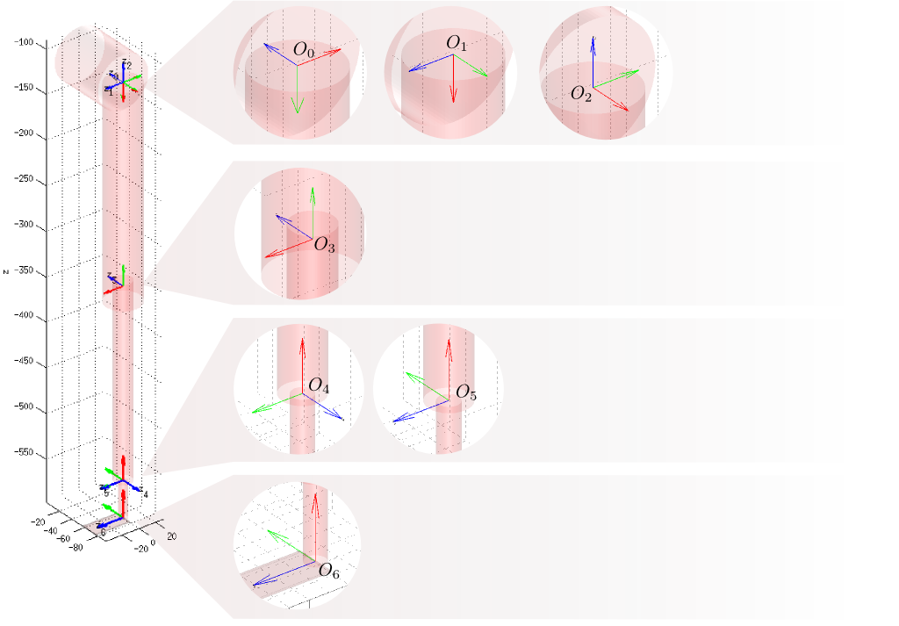
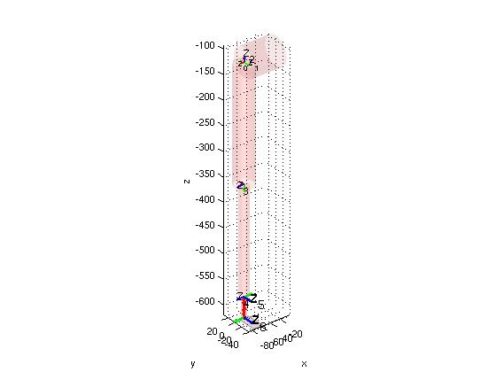

# **iCub Forward Kinematics - Legs**

## Left-V1
Here's described how to construct the matrix T_RoLf whose definition is given in [ICubForwardKinematics](./icub-forward-kinematics.md). The matrix is constructed in two steps i.e. T_RoLf = T_Ro0 * T_0n. The first matrix T_Ro0 describes the rigid roto-translation from the root reference frame to points in the 0th reference frame as defined by the [Denavit-Hartenberg convention](https://github.com/icub-tech-iit/documentation/raw/master/docs/icub_kinematics/icub-forward-kinematics/assets/chap3-forward-kinematics.pdf). In this case T_Ro0 is just a rigid rotation which aligns the z-axis with the first joint of the waist. The second matrix T_0n corresponds to the Denavit-Hartenberg description of the forward kinematic, i.e. the roto-translation from the 0th reference frame to the nth reference frame being n the number of degrees of freedom.

The matrix T_0n is itself the composition of n matrices as defined by the DH convention: `T_0n = T_01 T_12 ... T_(n-1)n`.
Here is the updated [matlab](https://github.com/icub-tech-iit/documentation/raw/master/docs/icub_kinematics/icub-forward-kinematics/assets/ICubFwdKinNew.zip) code for computing the forward kinematics with the Denavit Hartenberg notation.

The foot reference frame is located in the palm as shown in the CAD figure. The '''x''' axis is in '''red'''. The '''y''' axis is in '''green'''. The '''z''' axis is in blue. 

|   |   |
|---|---|
| | |

Here is the matrix T\_Ro0:

|     |     |     |        |
|-----|-----|-----|--------|
| 1   | 0   | 0   | 0      |
| 0   | 0   | 1   | -68.1  |
| 0   | -1  | 0   | -119.9 |
| 0   | 0   | 0   | 1      |

Here is the table of the actual DH parameters which describe T\_01,
T\_12, ... T\_(n-1)n.

| Link i / H – D | Ai (mm) | d\_i (mm) | alpha\_i (rad) | theta\_i (deg)         |
|----------------|---------|-----------|----------------|------------------------|
| i = 0          | 0       | 0         | -pi/2          | 90 + (-44 -&gt; +132)  |
| i = 1          | 0       | 0         | -pi/2          | 90 + (-119 - &gt; +17) |
| i = 2          | 0       | -223.6    | pi/2           | -90 + (-79 -&gt; +79)  |
| i = 3          | -213    | 0         | pi             | 90 + (-125 -&gt; +0)   |
| i = 4          | 0       | 0         | -pi/2          | -42 -&gt; +21          |
| i = 5          | -41     | 0         | 0              | -24 -&gt; +24          |

## Left-V2_5
This page describes how to construct the matrix T\_RoLf whose definition
is given in [ICubForwardKinematics](./icub-forward-kinematics.md). The matrix is constructed in two
steps i.e. T\_RoLf = T\_Ro0 \* T\_0n. The first matrix T\_Ro0 describes
the rigid roto-translation from the root reference frame to points in
the 0*th* reference frame as defined by the [Denavit-Hartenberg convention](https://github.com/icub-tech-iit/documentation/raw/master/docs/icub_kinematics/icub-forward-kinematics/assets/chap3-forward-kinematics.pdf). In this case T\_Ro0 is just a rigid rotation which aligns
the z-axis with the first joint of the waist. The second matrix T\_0n
corresponds to the Denavit-Hartenberg description of the forward
kinematic, i.e. the roto-translation from the 0th reference frame to the
n*th* reference frame being n the number of degrees of freedom.

The matrix T\_0n is itself the composition of n matrices as defined by
the DH convention: `T\_0n = T\_01 T\_12 ... T\_(n-1)n`. 
Here is the updated [matlab](https://github.com/icub-tech-iit/documentation/raw/master/docs/icub_kinematics/icub-forward-kinematics/assets/ICubFwdKinNew.zip) code for computing the forward kinematics with the Denavit Hartenberg notation.

The foot reference frame is located at its sole as shown in the CAD
figure. The **x** axis is in **red**. The
**y** axis is in **green**. The
**z** axis is in blue.

Here is the matrix T\_Ro0:

|     |     |     |        |
|-----|-----|-----|--------|
| 1   | 0   | 0   | 0      |
| 0   | 0   | 1   | -68.1  |
| 0   | -1  | 0   | -119.9 |
| 0   | 0   | 0   | 1      |

Here is the table of the actual DH parameters which describe T\_01,
T\_12, ... T\_(n-1)n.

| Link i / H – D | a\_i (mm) | d\_i (mm) | alpha\_i (rad) | theta\_{i} + (ang. range) (deg) |
|----------------|-----------|-----------|----------------|---------------------------------|
| i = 0          | 0         | 0         | -pi/2          | 90 + (-44 -&gt; +132)           |
| i = 1          | 0         | 0         | -pi/2          | 90 + (-119 - &gt; +17)          |
| i = 2          | -0.9175   | -234.545  | pi/2           | -90 + (-79 -&gt; +79)           |
| i = 3          | -200.5    | 0         | pi             | 90 + (-125 -&gt; +0)            |
| i = 4          | 0         | 0         | -pi/2          | 0 + (-42 -&gt; +21)             |
| i = 5          | -68.05    | -3.5      | 0              | 0 + (-24 -&gt; +24)             |

# ICubWaistRightLegKinematics

## Right-V1
This page describes how to construct the matrix T_RoRf whose definition is given in [ICubForwardKinematics](./icub-forward-kinematics.md). The matrix is constructed in two steps i.e. T_RoRf = T_Ro0 * T_0n. The first matrix T_Ro0 describes the rigid roto-translation from the root reference frame to points in the 0th reference frame as defined by the [Denavit-Hartenberg convention](https://github.com/icub-tech-iit/documentation/raw/master/docs/icub_kinematics/icub-forward-kinematics/assets/chap3-forward-kinematics.pdf). In this case T_Ro0 is just a rigid rotation which aligns the z-axis with the first joint of the waist. The second matrix T_0n corresponds to the Denavit-Hartenberg description of the forward kinematic, i.e. the roto-translation from the 0th reference frame to the nth reference frame being n the number of degrees of freedom.

The matrix T_0n is itself the composition of n matrices as defined by the DH convention: `T_0n = T_01 T_12 ... T_(n-1)n`. Here is the updated [matlab](https://github.com/icub-tech-iit/documentation/raw/master/docs/icub_kinematics/icub-forward-kinematics/assets/ICubFwdKinNew.zip) code for computing the forward kinematics with the Denavit Hartenberg notation.

The foot reference frame is located in the palm as shown in the CAD figure. The **x** axis is in **red**. The
**y** axis is in **green**. The
**z** axis is in blue.

|   |   |
|---|---|
| | |

Here is the matrix T\_Ro0:

|     |     |     |        |
|-----|-----|-----|--------|
| 1   | 0   | 0   | 0      |
| 0   | 0   | 1   | 68.1   |
| 0   | -1  | 0   | -119.9 |
| 0   | 0   | 0   | 1      |

Here is the table of the actual DH parameters which describe T\_01,
T\_12, ... T\_(n-1)n.

| Link i / H – D | Ai (mm) | d\_i (mm) | alpha\_i (rad) | theta\_i (deg)         |
|----------------|---------|-----------|----------------|------------------------|
| i = 0          | 0       | 0         | pi/2           | 90 + (-44 -&gt; +132)  |
| i = 1          | 0       | 0         | pi/2           | 90 + (-119 - &gt; +17) |
| i = 2          | 0       | 223.6     | -pi/2          | -90 + (-79 -&gt; +79)  |
| i = 3          | -213    | 0         | pi             | 90 + (-125 -&gt; +0)   |
| i = 4          | 0       | 0         | pi/2           | -42 -&gt; +21          |
| i = 5          | -41     | 0         | pi             | (-24 -&gt; +24)        |

## Right-V2_5
This page describes how to construct the matrix T_RoLf whose definition is given in [ICubForwardKinematics](./icub-forward-kinematics.md). The matrix is constructed in two steps i.e. T_RoLf = T_Ro0 * T_0n. The first matrix T_Ro0 describes the rigid roto-translation from the root reference frame to points in the 
0''th'' reference frame as defined by the[Denavit-Hartenberg convention](https://github.com/icub-tech-iit/documentation/raw/master/docs/icub_kinematics/icub-forward-kinematics/assets/chap3-forward-kinematics.pdf). 
In this case T_Ro0 is just a rigid rotation which aligns the z-axis with the first joint of the waist.
The second matrix T_0n corresponds to the Denavit-Hartenberg description of the forward kinematic, i.e. the roto-translation from the 0th reference frame to the n''th'' reference frame being n the number of degrees of freedom.

The matrix T_0n is itself the composition of n matrices as defined by the DH convention: `T_0n = T_01 T_12 ... T_(n-1)n`. 
Here is the updated [matlab](https://github.com/icub-tech-iit/documentation/raw/master/docs/icub_kinematics/icub-forward-kinematics/assets/ICubFwdKinNew.zip) code for computing the forward kinematics with the Denavit Hartenberg notation.

The foot reference frame is located at its sole as shown in the CAD figure. The '''x''' axis is in '''red'''. The '''y''' axis is in '''green'''. The '''z''' axis is in blue. 

Here is the matrix T\_Ro0:

|     |     |     |        |
|-----|-----|-----|--------|
| 1   | 0   | 0   | 0      |
| 0   | 0   | 1   | 68.1   |
| 0   | -1  | 0   | -119.9 |
| 0   | 0   | 0   | 1      |

Here is the table of the actual DH parameters which describe T\_01,
T\_12, ... T\_(n-1)n.

| Link i / H – D | Ai (mm) | d\_i (mm) | alpha\_i (rad) | theta\_i + (ang. range) (deg) |
|----------------|---------|-----------|----------------|-------------------------------|
| i = 0          | 0       | 0         | pi/2           | 90 + (-44 -&gt; +132)         |
| i = 1          | 0       | 0         | pi/2           | 90 + (-119 -&gt; +17)         |
| i = 2          | -0.9175 | 234.545   | -pi/2          | -90 + (-79 -&gt; +79)         |
| i = 3          | -200.5  | 0         | pi             | 90 + (-125 -&gt; +0)          |
| i = 4          | 0       | 0         | pi/2           | 0 + (-42 -&gt; +21)           |
| i = 5          | -68.05  | 3.5       | pi             | 0 + (-24 -&gt; +24)           |
