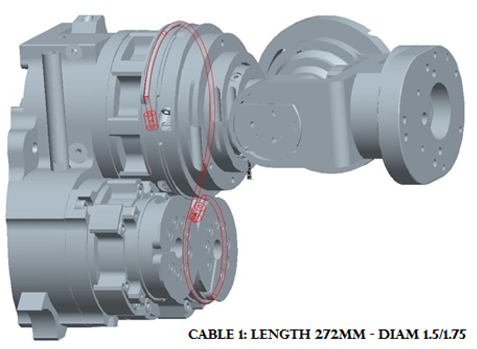
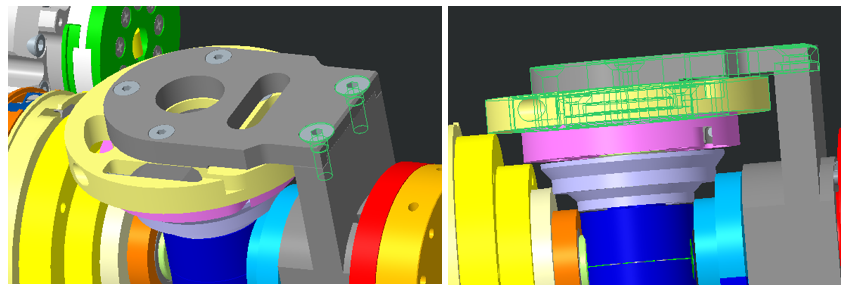
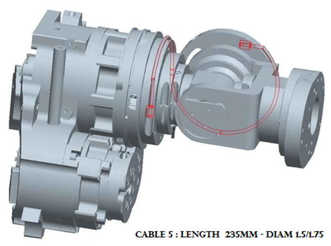
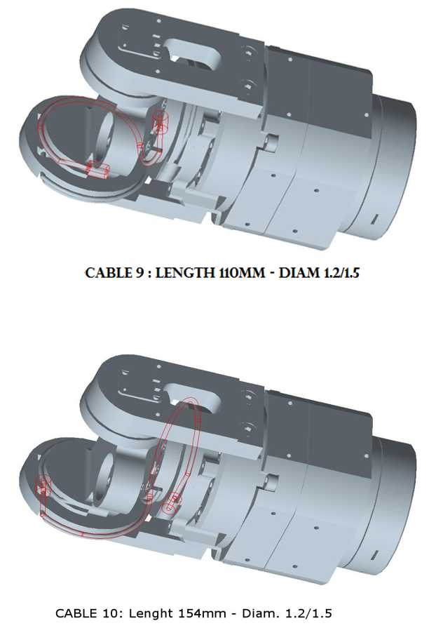
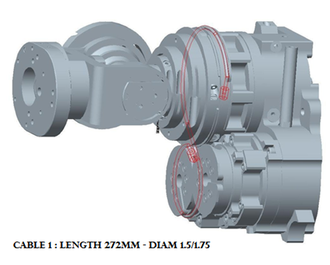
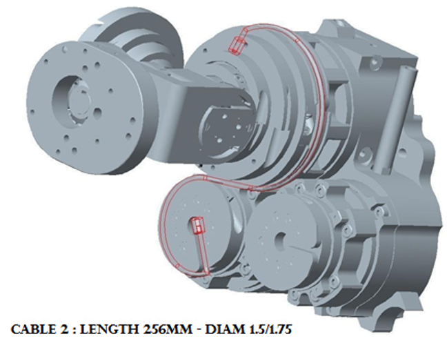
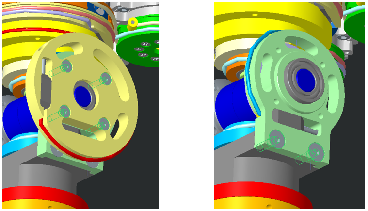
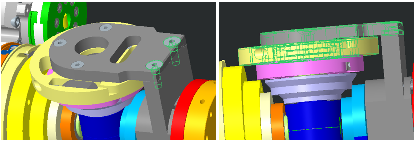
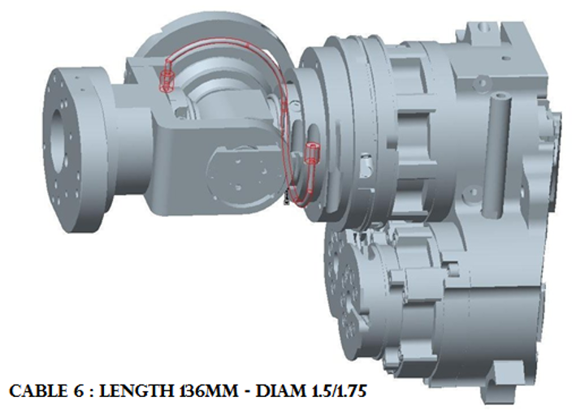
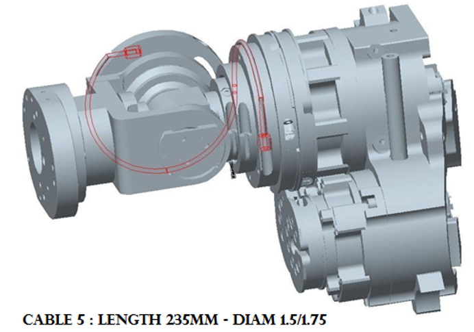

# Shoulder & Elbow

This chapter describes the wiring procedure for the cables of the shoulders and elbows, for every version of iCub made from version 1 to version 2.5, either in mounting phase or during a maintenance.

<!--
Spalle e gomiti
Il presente Capitolo descrive la procedura di cablaggio dei cavi delle spalle e dei gomiti di tutte le versioni dei Robot realizzati dalla versione 1 alla versione 2.5, sia in fase di costruzione che in fase di manutenzione
-->

## 1	Cable Construction

 1  : length 272 mm - Diam. 1.5/1.75

 2  : length 256 mm - Diam. 1.5/1.75

 3  : length 279 mm - Diam. 1.5/1.75 

 4  : length 250 mm - Diam. 1.5/1.75

 5  : length 235 mm - Diam. 1.5/1.75

 6  : length 136 mm - Diam. 1.5/1.75

 7  : length 163 mm - Diam. 1.2/1.50

 8  : length 121 mm -  Diam. 1.2/1.50

 9  : length 110 mm - Diam. 1.2/1.50

 10: length 154 mm - Diam. 1.2/1.50

> Cables from 1 to 6 are RC_IIT_019_G_00X - X from 1 to 6 - each made of U7191517 (IITCODE 2390) with different lengths (see the list above) and 2 crimps RC_TLR_003_P_101 (IITCODE 3492). The assembly resulting cable can be purchased from with IITCODE from 4758 to 4763.
<!-- 
Gli IITCODE dei cavi da 1 a 6 sono da 4758 a 4763. Vengono realizzati mediante cavo di acciaio U7191517 codice IIT 2390 e n. 2 crimp codice IIT 3492. Le misure sono presenti nella lista
-->

|IITCODE   |Alias |Description      |
|---|---|---|
|4758|RC_IIT_019_G_001|SHOULDER ROTATION CABLE 1|
|4759|RC_IIT_019_G_002|SHOULDER ROTATION CABLE 2|
|4760|RC_IIT_019_G_003|SHOULDER ROTATION CABLE 3|
|4761|RC_IIT_019_G_004|SHOULDER ROTATION CABLE 4|
|4762|RC_IIT_019_G_005|SHOULDER ROTATION CABLE 5|
|4763|RC_IIT_019_G_006|SHOULDER ROTATION CABLE 6|
|2390   |U7191517|Stainless steel microcable, cable construction 7x19mm, nom. dia 1,5mm, outer dia 1,75mm, Polyamide coated, AISI 316 - CARL STAHL GMBH   |
|3492   |RC_TLR_003_P_101  |Thimble for cable 1.75mm (Diam int/ext/L 1.6/4.6/6 mm) - material X5CrNiMo1712 - AISI 316   |
|1895|IIT_003_P_006_00|LEFT PULLEY - CRIMP COVER|
|1896|IIT_003_P_007_00 |RIGHT PULLEY - CRIMP COVER|

> For Cable 7-8-9-10 measures see above (respectively IITCODE from 13736 to 13739). **Alternatively you could build your own, made from U7191215 (IITCODE 2389) and 2 crimps (IITCODE 3877) BUT note that it is really important to shrink down to 4mm the crimp that will be inside the tensioner holder**

<!-- 
Per i cavi 7-8-9-10 fare riferimento a descrizione in IITCODE 13736-7-8-9
-->

|IITCODE   |Alias|Description      |
|---|---|---|
|13736|RC_IIT_019_G_029|U7191215/SE000094 - 163mm - cyl. nipple AM420716/NI000007 - ball nipple KU000012 - CARL STAHL GMBH|
|13737|	RC_IIT_019_G_030|U7191215/SE000094 - 121mm - cyl. nipple AM420716/NI000007 - ball nipple KU000012 - CARL STAHL GMBH|
|13738|RC_IIT_019_G_031 |U7191215/SE000094 - 110mm - cyl. nipple AM420716/NI000007 - ball nipple KU000012 - CARL STAHL GMBH|
|13739|	RC_IIT_019_G_032 |U7191215/SE000094 - 154mm - cyl. nipple AM420716/NI000007 - ball nipple KU000012 - CARL STAHL GMBH|
|2389| U7191215 |Stainless steel microcable, cable construction 7x19mm, nom. dia 1,2mm, outer dia 1,5mm, Polyamide coated, AISI 316 - CARL STAHL GMBH|
|3877| RC_TLR_005_P_101 |Thimble for cable Dia 1.5mm (Inner dia 1.25mm)|

!!! danger "The cabling sequence for the shoulder is the following:"
    <h4>
**(1 - 2) - (3 - 4) - (8 - 7) - (6 - 5)**
</h4>

<!--
Consiglio
La sequenza del  cablaggio dei cavi spalla è la seguente:   Cavo n. (1-2) - (3-4) - (8-7) - (6-5)
-->

## 2	Left Shoulder

!!! note "Rules for a good start"
    1.Always remove the broken cable

    2.Pay attention of putting the tensionner upside down so that the crimp does not exit
    
    3a.Keep in Mind that the shoulder is a set of 4 pairs of antagonistic cables : (1-2), (3-4), (8-7), (6-5)
    
    3b.And by so,to put back in place one pair of cable you need to make sure that the tensionner for both cables are loose

|**Block of pulleys**|**Tensionner fully opened**|**Cavity of the tensionner hidden - crimp can't escape**|
|:-----:|:-----:|:-----:|
||||

### 2.1	Left Shoulder Rotation Cable 1 and 2

> Follow the diagram above to route the cable N1. Once the head of the crimp reach the small pulley. Add atop of it the left crimp cover in ABS
(IIT CODE: 1895)

|**Crimp cover above the small pulley**|**Left crimp cover**|
|:-----:|:-----:|
|||

<!--
Una volta cablato   il cavo, nel passaggio del cavo attorno alla puleggia piccola   RC_TLR_003_P_037 posizionare il copri cavo in abs (plastica) ovvero il   pezzo  IIT_003_P_006_00 SX
-->

!!! Danger
    You need to remove both tensioner of cable 2 and 3 in order to change one of them - meaning re-cabling pairs (1-2) and (3-4)

 

> Route cable N2 as per the diagram above.
> 
> Now you can tense both screws for tension cable 1 and 2

!!! TIP
    Do cycles of 5 turns for each screws in order to find an equal tensioning
    

### 2.2	Left Shoulder Elevation Cable 3 and 4

> As per cable N1, just route cable N3 following the diagram above and prevent the crimp from escaping by adding the left cover crimp (IITCODE : 1895)

<!--
Una volta cablato   il cavo, nel passaggio del cavo attorno alla puleggia piccola   RC_TLR_003_P_037 posizionare il copri cavo in abs (plastica) ovvero il   pezzo  IIT_003_P_006_00 SX
-->

> Route cable N4 as per the diagram above.
> 
> Now you can tense both screws for tension cable 3 and 4

!!! TIP
    Do cycles of 5 turns for each screws in order to find an equal tensioning

### <u>IMPORTANT NOTES</u> for Cable from 8 to 5

!!! danger "From cable 8 to 5"
    **To mount the cables 8 - 7 - 6 - 5, it is important to start with all of them already disconnected. You   first need to replace the broken cable(s) by starting to enter the head crimp   (4mm size – smaller one or ball crimp) of the cable 7 and 8 inside their respective   tensioner. You will need later to start wiring cable 7 and 8 in their future   path BUT to do so it is necessary to create SPACE FOR THE CRIMPS TO PASS.**
    
    **There are 2 designs for the   shoulder so it is necessary to see the difference in between both of them to know how to untighten the good pieces and screws to create that SPACE**

<h3>VERSION 1</h3>

> 1. Remove the beige pulley (remove the 4 screws M2x12) until you don't remount cable 5
> 2. Reach the 2 screws M4x12 on the green pulley and just untighten them until you can pass both crimp 8 and 7 following the routing explain below.
> 3. Close the gap in order to prevent the cables 8 and 7 to exit - tighten the 2 screws M4x12
> 4. Start wiring

<h3>VERSION 2</h3>

> 1. Loose the the 2 screws M4x12 to slide a bit the block of 2 pulleys (grey and yellow) to give space until you can pass both crimp 8 and 7 following the routing explain below.
> 2. Close the gap in order to prevent the cables 8 and 7 to exit - tighten the 2 screws M4x12
> 3. Start wiring

### 2.3	Left Shoulder Elevation Cable 8 and 7

In order to insert these cables, you need to turn the 2 pulleys and align the teeth as shown in the picture above.

> Once both crimps jumped over the 2 teeth holding the crimp in position - you can start tightening the screws of the tensioners 7 and 8.

### 2.4	Left Shoulder Elevation Cable 6 and 5

> Those 2 cables are quite straight forward to mount, just follow the 2 following pictures.

             

> Once both crimps jumped over the 2 teeth holding the crimp in position you can start tightening the screws of the tensioners 6 and 5.

## 3	Left Elbow cabling 

> Those 2 cables are not specifically difficult to route but unfortunately you need to operate cautiously to do NOT damage the electronical boards located beneath the upper arm.

!!! warning
    **EITHER** you remove the Lower Arm by Following the instructions for Lower Arm [**V1**](remove.md#position001) or Lower Arm [**V2**](remove.md#position002)
    
    **OR** You are helped by **someone else** to hold the Lower Arm (Forearm + Hand).

 

!!! tip "Rules of routing"
    1. Remove the lower part of the upper arm cover if  NOT done yet
        2. Remove the lateral plate (the **ONE** with **NO** sensor) by unmounting the 2 screws holding it.
        3. Turn the main shaft by the help of a screw driver to apply enough torque to make it spin, until you reach the same situation as the pictures above (this is the view from **below** of the elbow)
        4. Replace the broken cable(s) by starting to enter the head crimp   (4mm size – smaller one or ball crimp) of the cable 9 and 10 inside their respective tensioner.
        5. Pass both heads of crimp before reattaching the Lateral Plate.
        6. Position the head of crimp in their socket
        7. start tightening the screws of both tensioner.

## 4	Right Shoulder

!!! advice
    Take  look at the beginning of this web page to have all the information related to the dimensions of cables and how to get or build them.

!!! danger "The cabling sequence for the shoulder is the following:"
    <h4>
**(1 - 2) - (3 - 4) - (8 - 7) - (6 - 5)**
</h4>

<!--
Consiglio
La sequenza del  cablaggio dei cavi spalla è la seguente:   Cavo n. (1-2) - (3-4) - (8-7) - (6-5)
-->

!!! note "Rules for a good start"
    1.Always remove the broken cable

    2.Pay attention of putting the tensionner upside down so that the crimp dont exit
    
    3a.Keep in Mind that the shoulder is a set of 4 pairs of antagonistic cables : (1-2), (3-4), (8-7), (6-5)
    
    3b.And by so,to put back in place one pair of cable you need to make sure that the tensionner for both cables are loose

|**Block of pulleys**|**Tensionner fully opened**|**Cavity of the tensionner hidden - crimp can't escape**|
|:-----:|:-----:|:-----:|
||||

### 4.1	Right Shoulder Rotation Cable 1 and 2

> Follow the diagram above to route the cable N1. Once the head of the crimp reach the small pulley. Add atop of it the right crimp cover in ABS
(IIT CODE: 1896)

|**Crimp cover above the small pulley**|**Right crimp cover**|
|:-----:|:-----:|
|||

<!--
Una volta cablato   il cavo, nel passaggio del cavo attorno alla puleggia piccola   RC_TLR_003_P_037 posizionare il copri cavo in abs (plastica) ovvero il   pezzo  IIT_003_P_006_00 SX
-->

!!! Danger
    You need to remove both tensioner of cable 2 and 3 in order to change one of them - meaning re-cabling pairs (1-2) and (3-4)

 

> Route cable N2 as per the diagram above.
> 
> Now you can tense both screws for tension cable 1 and 2

!!! TIP
    Do cycles of 5 turns for each screws in order to find an equal tensioning
    

### 4.2	Right Shoulder Elevation Cable 3 and 4

> As per cable N1, just route cable N3 following the diagram above and prevent the crimp from escaping by adding the right cover crimp (IITCODE : 1896)

<!--
Una volta cablato   il cavo, nel passaggio del cavo attorno alla puleggia piccola   RC_TLR_003_P_037 posizionare il copri cavo in abs (plastica) ovvero il   pezzo  IIT_003_P_006_00 SX
-->

> Route cable N4 as per the diagram above.
> 
> Now you can tense both screws for tension cable 3 and 4

!!! TIP
    Do cycles of 5 turns for each screws in order to find an equal tensioning

### <u>IMPORTANT NOTES</u> for Cable from 8 to 5

!!! danger "From cable 8 to 5"
    **To mount the cables 8 - 7 - 6 - 5, it is important to start with all of them already disconnected. You   first need to replace the broken cable(s) by starting to enter the head crimp   (4mm size – smaller one or ball crimp) of the cable 7 and 8 inside their respective   tensioner. You will need later to start wiring cable 7 and 8 in their future   path BUT to do so it is necessary to create SPACE FOR THE CRIMPS TO PASS.**
    
    **There are 2 designs for the   shoulder so it is necessary to see the difference in between both of them to know how to untighten the good pieces and screws to create that SPACE**

<h3>VERSION 1</h3>

> 1. Remove the beige pulley (remove the 4 screws M2x12) until you don't remount cable 5
> 2. Reach the 2 screws M4x12 on the green pulley and just untighten them until you can pass both crimp 8 and 7 following the routing explain below.
> 3. Close the gap in order to prevent the cables 8 and 7 to exit - tighten the 2 screws M4x12
> 4. Start wiring

<h3>VERSION 2</h3>

> 1. Loose the the 2 screws M4x12 to slide a bit the block of 2 pulleys (grey and yellow) to give space until you can pass both crimp 8 and 7 following the routing explain below.
> 2. Close the gap in order to prevent the cables 8 and 7 to exit - tighten the 2 screws M4x12
> 3. Start wiring

### 4.3	Right Shoulder Elevation Cable 8 and 7

> Once both crimps jumped over the 2 teeth holding the crimp in position - you can start tightening the screws of the tensioners 7 and 8.

### 4.4	Right Shoulder Elevation Cable 6 and 5

> Those 2 cables are quite straight forward to mount, just follow the 2 following pictures.

             

> Once both crimps jumped over the 2 teeth holding the in position you can start tightening the screws of the tensioners 6 and 5

## 5	Right Elbow cabling 

> Those 2 cables are not specifically difficult to route but unfortunately you need to be cautious to proceed undamaging the electronical board located beneath the upper arm.

!!! warning
    **EITHER** you remove the Lower Arm by Following the instructions for Lower Arm [**V1**](remove.md#1-lower-arm-v1) or Lower Arm [**V2**](remove.md#2-lower-arm-v2)
    
    **OR** You are helped by **someone else** to hold the Lower Arm.

 

!!! tip "Rules of routing"
    1. Remove the lower part of the upper arm cover if  NOT done yet
        2. Remove the lateral plate (the **ONE** with **NO** sensor) by unmounting the 2 screws holding it.
        3. Turn the main shaft by the help of a screw driver to apply enough torque to make it spin, until you reach the same situation as the pictures above (this is the view from **below** the elbow)
        4. Replace the broken cable(s) by starting to enter the head crimp   (4mm size – smaller one or ball crimp) of the cable 9 and 10 inside their respective tensioner.
        5. Pass both heads of crimp before reattaching the Lateral Plate.
        6. Position the head of crimp in their socket
        7. start tightening the screws of both tensioner.